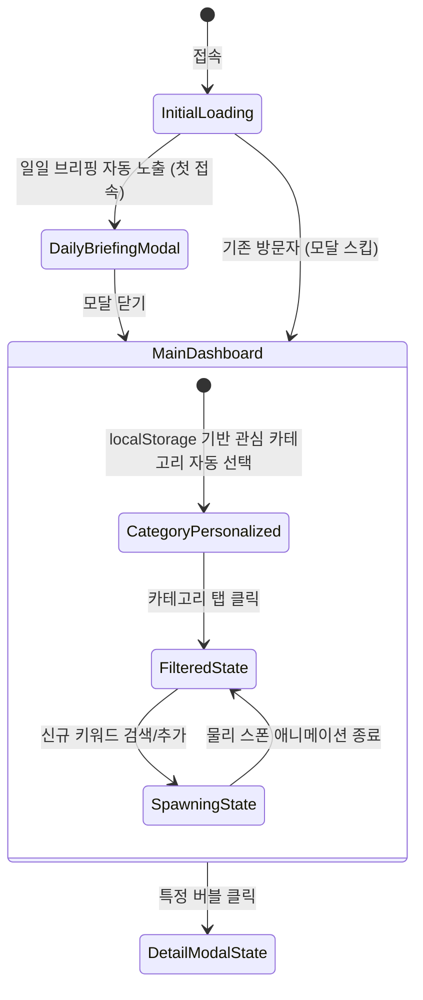

# 💡Trend 제공 서비스 기획서

> [!TIP]
> **실제 작동하는 프로토타입 실행**: [로컬 프로토타입 (index.html)](file:///Users/tatata/Desktop/Ai_agent/hub/index.html)을 클릭하여 구현 결과를 즉시 시뮬레이션할 수 있습니다.

새로운 관심사나 분야를 시작하려는 모든 사람들을 위한 **초간단 실시간 트렌드 시각화 대시보드** 기획안입니다.  
본 기획서는 유저가 고민하거나 공부할 필요 없이 3초 만에 트렌드를 파악할 수 있는 **'Zero-Thinking 정보 제공'**에 초점을 맞추어 작성되었습니다.

---

## 1. 문제 정의 (Problem Definition)

### 1.1. 관심사가 생겼을 때 트렌드 파악의 어려움
* **"시작하고 싶지만 무엇이 유행인지 모름"**: IT/개발 스택, 자격증, 영어 공부, 대기업/스타트업 채용 트렌드 등 새로운 진로나 취업 분야에 관심을 가지게 되었을 때, 무엇이 현재 주류(트렌드)이고 유행하는 기술/자격증인지 파악하는 것이 대학생 및 취업 준비생(입문자)에게는 첫 번째 관문입니다.
* **"탐색의 비효율성"**: 검색 포털에 검색하거나 커뮤니티를 며칠간 눈팅하지 않으면 트렌드의 '전체적인 맥락'을 한눈에 보기 어렵습니다.

### 1.2. 정보 과부하와 피로도
* 인스타그램, 유튜브, 블로그 등 플랫폼별로 정보가 너무 파편화되어 있고, 광고성 추천 정보가 많아 입문자가 스스로 '진짜 트렌드'를 필터링하는 데 피로를 느낍니다.

### 1.3. 기존 트렌드 툴의 높은 진입장벽
* 네이버 데이터랩이나 구글 트렌드는 사용자가 '어떤 키워드를 검색해야 하는지' 미리 알고 있어야 하며, 그래프와 숫자로만 이루어져 있어 일반 사용자가 직관적으로 정보를 얻기에는 불친절합니다.

### 1.4. 해결하려는 핵심 가치 (Value Proposition)
* **초기 관심사의 이정표 제공**: 특정 성별/연령을 넘어, **"새로운 관심사가 생긴 모든 이들"**이 헤매지 않고 현재 유행하는 아이템을 바로 알 수 있는 트렌드 나침반을 제공합니다.
* **Zero-Thinking 시각 대시보드**: 고민하거나 별도의 검색 공부 없이, 단 3초 만에 둥둥 떠다니는 버블의 직관적인 랭킹을 통해 트렌드를 시각적으로 체득하게 합니다.

---

## 2. 사용자 시나리오 (User Scenarios)

### 시나리오 A: IT/개발 관심 대학생 (민우, 25세)
> **"특별한 목적 없이 접속하더라도, 평소 관심 있는 IT/개발 트렌드를 자동으로 훑어볼 수 있으면 좋겠어."**
1. 컴퓨터공학과 재학생 민우는 수시로 Trend 앱에 접속합니다.
2. 앱은 민우의 이전 방문 패턴을 `localStorage`로 기억하고 있어서, 별도의 탭 클릭 없이 접속하자마자 **[IT/개발 💻]** 카테고리가 자동으로 활성화되어 대시보드가 로드됩니다.
3. 민우는 화면 중앙에서 유독 크게 둥둥 떠다니는 `#1 Cursor IDE` 버블을 발견하고 마우스를 올려 봅니다.
4. 호기심에 버블을 클릭하자 상세 패널에 "Cursor IDE 단축키 및 AI 자동완성 꿀팁"에 대한 트렌드 요약글과 연관 검색어(LLM, 프롬프트, Copilot 등)가 나타나 요즘 AI 개발 툴 트렌드 맥락을 3초 만에 자연스럽게 흡수합니다.
5. 상세 패널 내의 관련 검색 키워드들을 눌러 보며 관련된 추가 지식을 앱 내에서 편리하게 탐색하고 학습 계획에 참고합니다.

### 시나리오 B: 스펙 준비 취준생 (지은, 23세)
> **"공부하다 머리 식힐 겸 가볍게 들어와서, 내가 찜해둔 자격증이나 어학 트렌드 변동을 편하게 체크하고 싶어."**
1. 취업 준비생 지은은 앱에 접속하여 **[자격증/어학 📝]** 카테고리를 필터링합니다.
2. 검색창 하단의 추천 키워드 영역에 평소 관심 있어 하던 `#SQLD 53회 기출`, `#정처기 실기` 태그가 자동으로 추천 노출되어 있습니다.
3. 지은은 텍스트를 직접 입력할 필요 없이 `#SQLD 53회 기출` 추천 태그를 클릭해 즉시 검색창에 입력하고 추가 버튼을 누릅니다.
4. 추가와 동시에 화면 한 구석에서 "SQLD 53회 기출" 버블이 새롭게 생성되어 다른 버블들과 튕기며 배치되는 물리 애니메이션을 보며 소소한 시각적 재미를 느낍니다.
5. 추가된 버블을 바탕으로 공부 계획 수립을 위한 탐색을 이어 나갑니다.

### 시나리오 C: 트렌드 민감 구직자 (소희, 26세)
> **"매일 아침 스마트폰으로 커피 마시며 오늘 아침 새로 뜬 핫 이슈나 채용 트렌드를 편하게 브리핑받고 싶어."**
1. 졸업예정자 소희는 무의식적으로 자연스럽게 앱에 접속합니다.
2. 접속과 동시에 **AI 트렌드 웰컴 모델**이 자동으로 팝업되어 "오늘의 취업/진로 1위 급상승: 토스 Next 신입 공채" 등 오늘의 주요 소식을 한눈에 브리핑받습니다.
3. 모달을 닫은 후 대시보드에서 붉게 켜진 `#10 토스 Next 신입 공채` 버블과 주변에 떠다니는 관련 버블들을 터치하며 최근의 구직 시장 트렌드 흐름을 흡수합니다.
----

## 3. 핵심 기능 

### 3.1. 실시간 트렌드 키워드 자동 추출 및 노출 (Automatic Trend Keyword Discovery & Display)
* **기능 개요**: 인터넷(커뮤니티, SNS 등) 상의 인기 유입 및 관심 트렌드를 자동 수집하여 유저에게 복잡한 조작이나 데이터 해석 없이 바로 핵심 트렌드 키워드를 시각적 카드 형태로 제공합니다.
* **주요 요약 사양**:
  - **연령대 및 관심사 필터링 (Advanced Filters)**: `10대`, `20대 초반`, `20대 후반` 등 연령층 필터링과 `패션`, `IT/개발`, `취업/진로` 등의 카테고리 필터를 연동 제공하여 맞춤형 트렌드를 즉시 탐색 가능하게 합니다.
  - **직관적인 실제 패션 아이템명 매칭 (Fashion Focus)**: 패션 분야 선택 시 20대 여성이 실제로 열광하는 실물 패션/뷰티 아이템(예: `살로몬 XT-6 스니커즈`, `인형 키링`, `글레이즈 멜팅 립틴트` 등)을 직관적인 정보명으로 직접 노출합니다.
  - **트렌드 추이 스파크라인 (Embedded Sparkline)**: 각 트렌드 카드 내부에 지난 6개월간의 관심도 추이 선형 그래프(SVG Sparkline)를 내장하여 실시간 상승/하락 트래픽을 직관적으로 고지합니다.
  - **간단한 요약 팝업**: 특정 트렌드 카드를 클릭 시 해당 트렌드의 정의와 간략한 언급 배경을 감성적인 메모지 형태로 노출합니다.

---

## 4. 화면 UI 구조 및 레이아웃

서비스의 대시보드는 Zero-Thinking 정보 습득이 가능하도록 한 화면에 필요한 모든 정보를 시각적으로 통합한 **단일 파일 대시보드 레이아웃**으로 설계되었습니다.

### 4.1. 화면 레이아웃 와이어프레임 (ASCII Structure)

```text
+-----------------------------------------------------------------------------------+
|  TRENDSCAN  [ 전체 | IT/개발 | 취업/진로 | 자격증/어학 | 트렌드/이슈 ]                   |
+-----------------------------------------------------------------------------------+
|  [주제 소개] 대학생/취준생을 위한 실시간 분야별 트렌드 시각화 대시보드 MVP                |
+-----------------------------------------------------------------------------------+
|                                                                                   |
|                              (  Cursor IDE  )                                     |
|              (  Next.js )                                 ( SQLD 기출 )           |
|                                                                                   |
|                       ( 토스 Next )          ( 영어회화 스픽 )                      |
|                                                                                   |
+-----------------------------------------------------------------------------------+
|  [검색 및 추가 패널]                        |  [세부 분석 패널]                     |
|  🔍 실시간 키워드 검색/추가                  |  📈 'Cursor IDE' 검색량 추이 (6개월)   |
|  +---------------------------------------+  |  ~~~~~~~~~~~~~~~~~~~~~~~~~~~~~~~~~  |
|  | 검색창 입력...                   [추가] |  |  |                                  |
|  +---------------------------------------+  |  |  +-----------------------------+ |
|  추천: #SQLD 53회  #정처기 실기              |  |________________________________| |
|                                             |  ☁️ 연관 검색어: LLM, 프롬프트, Copilot   |
+-----------------------------------------------------------------------------------+
```

### 4.2. 서비스 UI 디자인 목업 (Visual Mockup)


---

## 5. 화면별 상세 동작 시나리오 (Screen States)

대시보드 내에서의 상태 변화 및 사용자의 무의식적 발견 인터랙션은 다음과 같이 5가지 씬(Scene)의 화면 단위 동작으로 시각화되어 표현됩니다.

### Scene 1: 초기 진입 상태 (일일 브리핑 팝업)
- **화면 상태**: 접속 직후 배경 대시보드가 어둡게 블러 처리(`backdrop-filter: blur(16px)`)되며 은은한 파스텔 톤과 밀키 화이트 글래스모피즘이 가미된 웜 라이트 테마(20대 여성 타겟 감성 테마)의 웰컴 팝업 모달이 부드럽게 스케일 업(Scale Up)하며 로드됩니다.
- **시각 정보**:
  1. **AI 자연어 동향 요약 브리핑**: 현재 데이터를 실시간 연산하여 "현재 대세는 IT/개발 분야이며, AI 코딩 키워드가 강세이고 토스 채용이 급상승 중"이라는 요약 텍스트 노출.
  2. **핵심 KPI 지표 카드**: 1위 키워드와 핫 라이징 키워드가 각각 개별 카드 컴포넌트로 나뉘어 증감 수치 뱃지와 함께 노출.
- **인터랙션**:
  - 유저가 상단 우측 닫기(X) 버튼을 누르거나 팝업 바깥 영역(백드롭)을 클릭하면 모달이 페이드 아웃되며 메인 대시보드가 선명해지고 활성화됩니다.
  - 하단 '오늘 하루 이 창을 다시 열지 않기'를 누르고 '대시보드 입장' 버튼을 클릭하면 `localStorage`에 상태가 보관되어 재방문 시 자동 스킵됩니다.
  - 상단 헤더의 `[✨ 데일리 브리핑 다시보기]`를 클릭하면 언제든지 Scene 1 상태로 재진입할 수 있습니다.

### Scene 2: 홈 피드 탐색 상태 (관심 카테고리 자동 활성화)
- **화면 상태**: `localStorage`에 저장된 유저의 이전 관심사(예: IT/개발) 탭이 자동으로 선택된 상태로 대시보드가 구성됩니다.
- **시각 정보**: 카테고리에 해당하는 버블(`Cursor IDE`, `Next.js` 등)들만 화면 중앙에 조밀하게 뭉쳐 둥둥 떠다니며, 매칭되지 않는 다른 카테고리의 버블들은 크기가 `0`으로 축소되어 감춰집니다.
- **인터랙션**: 사용자가 다른 탭(예: 자격증/어학)을 누르면, 실시간으로 기존 버블들이 사방으로 흩어져 사라지고 새로운 버블들이 화면 중심을 향해 통통 튀며 모여드는 물리 재정렬 애니메이션이 발생합니다.

### Scene 3: 상세 정보 탐색 상태 (버블 클릭 상세 패널 활성화)
- **화면 상태**: 특정 버블(예: `Cursor IDE`)을 마우스로 클릭하면, 해당 버블 테두리에 하얀색 포커스 링과 함께 바깥쪽으로 맥박이 뛰는 듯한 펄스 링 overlay 애니메이션이 적용됩니다.
- **시각 정보**: 우측/하단의 **세부 분석 패널**이 활성화되며, 6개월간의 검색량 변동 추이를 담은 네온 컬러의 미니 그래프(SVG Sparkline)와 연관 검색 키워드(LLM, 프롬프트, Copilot 등)가 클라우드 태그 형태로 빛을 뿜으며 로드됩니다.
- **인터랙션**: 상세 창 내부의 연관 검색 태그를 클릭하면, 해당 검색어의 상세 분석 패널로 즉시 화면 상태가 갱신됩니다.

### Scene 4: 신규 트렌드 실시간 추가 상태 (스폰 물리 연출)
- **화면 상태**: 사용자가 검색창에 새로운 키워드(예: `SQLD 53회 기출`)를 검색하여 추가하면 발생합니다.
- **시각 정보**: 화면 중앙(또는 모서리) 영역에서 크기가 `0`인 버블이 순간적으로 생성되어 `지수(value)`에 비례하는 타겟 크기까지 0.3초간 팽창(Scale up)하며 스폰됩니다.
- **인터랙션**: 새롭게 추가된 버블은 기존에 배치되어 있던 버블들과 충돌(Collision Force)하며 통통 튕기는 탄성 반동(Spring physics) 연출을 보이고, 하단에 "'SQLD 53회 기출' 버블이 추가되었습니다!"라는 토스트 메시지가 나타납니다.

---

## 6. 화면 상태 전이 다이어그램 (State Transition Diagram)


