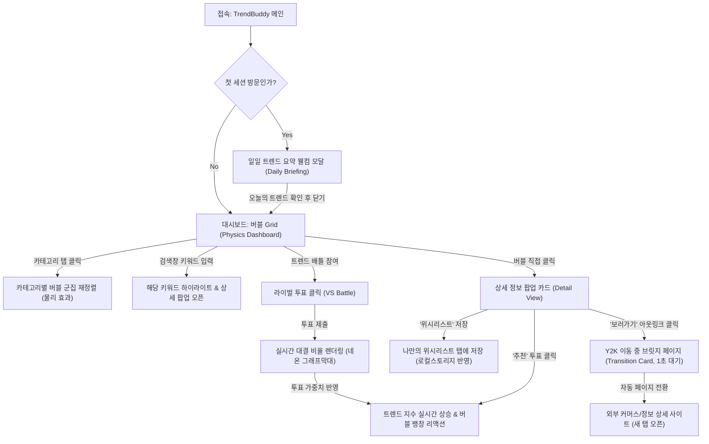

# 💡 TrendBuddy 서비스 기획서 (Git Wiki용)

새로운 관심사나 분야를 시작하려는 모든 사람들을 위한 **초간단 실시간 트렌드 시각화 대시보드** 기획안입니다.  
본 기획서는 유저가 고민하거나 공부할 필요 없이 3초 만에 트렌드를 파악할 수 있는 **'Zero-Thinking 정보 제공'**에 초점을 맞추어 작성되었습니다.

---

## 1. 문제 정의 (Problem Definition)

### 1.1. 관심사가 생겼을 때 트렌드 파악의 어려움
* **"시작하고 싶지만 무엇이 유행인지 모름"**: 패션, 테크 기기, 취미 등 새로운 관심사가 생겼을 때, 어떤 브랜드나 제품이 현재 주류(트렌드)이고 유행하는지 파악하는 것이 입문자에게는 첫 번째 관문입니다.
* **"탐색의 비효율성"**: 검색 포털에 검색하거나 커뮤니티를 며칠간 눈팅하지 않으면 트렌드의 '전체적인 맥락'을 한눈에 보기 어렵습니다.

### 1.2. 정보 과부하와 피로도
* 인스타그램, 유튜브, 블로그 등 플랫폼별로 정보가 너무 파편화되어 있고, 광고성 추천 정보가 많아 입문자가 스스로 '진짜 트렌드'를 필터링하는 데 피로를 느낍니다.

### 1.3. 기존 트렌드 툴의 높은 진입장벽
* 네이버 데이터랩이나 구글 트렌드는 사용자가 '어떤 키워드를 검색해야 하는지' 미리 알고 있어야 하며, 그래프와 숫자로만 이루어져 있어 일반 사용자가 직관적으로 정보를 얻기에는 불친절합니다.

### 1.4. 해결하려는 핵심 가치 (Value Proposition)
* **초기 관심사의 이정표 제공**: 특정 성별/연령을 넘어, **"새로운 관심사가 생긴 모든 이들"**이 헤매지 않고 현재 유행하는 아이템을 바로 알 수 있는 트렌드 나침반을 제공합니다.
* **Zero-Thinking 시각 대시보드**: 고민하거나 별도의 검색 공부 없이, 단 3초 만에 둥둥 떠다니는 버블의 직관적인 랭킹을 통해 트렌드를 시각적으로 체득하게 합니다.

---

## 2. 사용자 시나리오 (User Scenarios)

### 시나리오 A: 패션/러닝 입문자 (민우, 28세)
> **"러닝 크루에 가입했는데, 요즘 러너들은 어떤 의류나 신발을 선호하지?"**
1. 민우는 TrendBuddy 앱에 접속합니다.
2. 접속 후 메인의 **[패션 ⚡️]** 탭에서 가장 부풀어 오른 `#1 살로몬` 및 `#2 아크테릭스` 버블을 확인합니다.
3. 고프코어 및 러닝 카테고리 탭을 필터링하여 스니커즈류 인기 제품 리스트를 눈으로 훑어봅니다.
4. `#1 살로몬 XT-6` 버블을 클릭해 실제 코디 컷과 "요즘 아웃도어뿐만 아니라 일상용으로도 언급량이 폭증했다"는 트렌드 요약 1줄을 읽습니다.
5. '보러가기'를 클릭하여 1초 간의 역동적인 Y2K 이동 브릿지 화면을 거쳐 외부 편집숍 쇼핑 페이지로 넘어가 제품을 구매합니다.

### 시나리오 B: 테크/데스크셋업 입문 개발자 (지훈, 21세)
> **"나만의 코딩 환경을 꾸미고 싶어. 개발자용 키보드는 무엇이 대세일까?"**
1. 지훈은 상단 GNB에서 **[테크 💻]** 카테고리를 선택합니다.
2. 키보드 필터 탭을 누르자 관련 브랜드(키크론, 레오폴드 등) 버블들이 화면 중앙으로 쫀득하게 모이는 물리 애니메이션을 감상합니다.
3. 검색창에 '레오폴드'를 입력해 해당 버블을 하이라이트 시킨 뒤 상세 카드를 엽니다.
4. 최근 6개월 검색량 추이 그래프를 통해 해당 브랜드의 최근 트렌드 신뢰성을 확인하고, 연관 키워드(적축, 저소음 등) 정보를 파악해 첫 기계식 키보드 구매 힌트를 얻습니다.

### 시나리오 C: 라이프/홈카페 입문 직장인 (소희, 32세)
> **"요즘 유행하는 홈카페 에스프레소 머신은 어떤 브랜드가 제일 트렌디하지?"**
1. 소희는 **[라이프 🍕]** 카테고리에 접속합니다.
2. 하루 첫 접속 시 표시되는 **일일 트렌드 웰컴 모달**을 통해 "오늘의 라이프스타일 1위 급상승: 브레빌 홈카페 머신 (+15계단 상승)" 소식을 확인합니다.
3. 모달을 닫고 대시보드에서 `브레빌` 버블을 클릭해 감각적인 홈카페 인테리어 컷과 추천 1줄 평을 읽어봅니다.
4. 마음에 드는 기기들을 **'위시리스트'** 탭에 담아 저장해 두고, 평소 자신이 갖고 싶었던 브랜드 `드롱기` 버블에는 **'추천(Upvote)'**을 눌러 순위 상승 리액션을 실시간으로 감상합니다.

---

## 3. 핵심 기능 (Core Features)

### 3.1. 일일 트렌드 요약 웰컴 모달 (Daily Briefing)
* **기능**: 사용자가 하루 최초 접속 시(또는 세션당 1회) 자동으로 나타나는 네오 브루탈리즘 스타일의 웰컴 팝업.
* **콘텐츠**: "오늘의 트렌드 지수 1위 아이템", "어제 대비 순위가 가장 크게 도약한 급상승 키워드" 등을 다이내믹하게 브리핑.

### 3.2. 인터랙티브 물리 엔진 기반 버블 Grid (Physics Dashboard)
* **기능**: SVG/Canvas 상에서 패션/테크/라이프스타일 키워드 순위가 원형 버블 형태로 배치되어 둥둥 떠다니는 물리 대시보드.
* **동작**: 트렌드 지수가 높을수록 버블이 크고 번쩍이는 시각 효과를 가지며, 카테고리를 변경하면 해당 키워드들만 쫀득하게 가운데로 뭉치는 충돌 애니메이션 구현.

### 3.3. 상세 정보 팝업 카드 (Detail View)
* **기능**: 버블이나 검색 탭에서 선택한 아이템의 종합 정보를 슬라이딩 드롭다운 형태로 노출.
* **정보**: 실제 누끼/코디 컷 이미지, 유행 이유 1~2줄 핵심 요약, 관련 뉴스 요약 정보 링크 포함.

### 3.4. 사용자 추천(Upvote) 및 로컬 위시리스트
* **기능**: 유저 참여형 시스템. '추천' 클릭 시 버블 크기와 트렌드 순위에 실시간 반영. '위시리스트' 클릭 시 나만의 탭에 보관되며 `localStorage`를 통해 브라우저를 껐다 켜도 데이터 유지.

### 3.5. 중간 쿠션 랜딩 페이지 (Transition Card)
* **기능**: 외부 판매처/정보처 아웃링크로 나갈 때 중간에 거쳐가는 재미 중심의 브릿지 애니메이션 화면 (약 1초 대기 후 자동 이동).

### 3.6. 실시간 트렌드 배틀 (Trend VS Battle)
* **기능**: 대시보드 내 특정 영역에서 매주/매일 진행되는 두 라이벌 브랜드/아이템의 양자택일 미니 투표 위젯 (예: "살로몬 VS 아디다스 가젤", "키크론 VS 레오폴드").
* **효과**: 사용자가 즉시 투표에 참여하면 실시간 투표 비율이 네온 그래프막대 형태로 렌더링되며, 투표 결과가 해당 아이템들의 트렌드 누적 지수 및 버블 크기 성장에 가중치로 반영되도록 설계.

---

## 4. 화면 흐름 (Screen Flows)

사용자의 서비스 이용 여정은 아래 흐름도를 따라 매끄럽고 직관적으로 진행됩니다.

